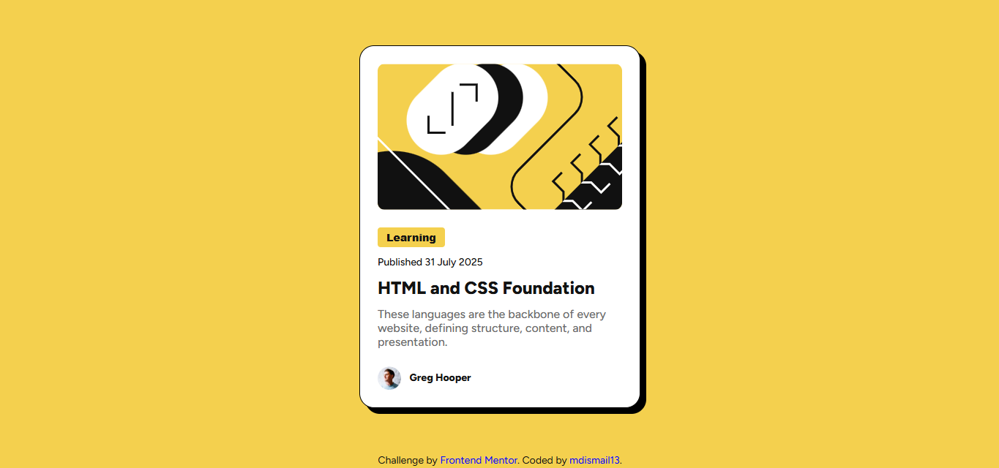

# Frontend Mentor - Blog preview card solution

This is my solution to the [Blog preview card challenge on Frontend Mentor](https://www.frontendmentor.io/challenges/blog-preview-card-ckPaj01IcS). This challenge helped me improve my HTML and CSS skills by building a realistic, responsive card layout.

## Table of contents

- [Overview](#overview)
- [Screenshot](#screenshot)
- [Links](#links)
- [Built with](#built-with)
- [What I learned](#what-i-learned)
- [Author](#author)

## Overview

### The challenge

Users should be able to:

- See hover states for the blog title
- View a responsive blog preview card with proper layout and spacing

## Screenshot



## Links

- Live Site URL: [https://mdismail13.github.io/blog-preview-card/](https://mdismail13.github.io/blog-preview-card/)
- Solution URL: [https://github.com/mdismail13/blog-preview-card.git](https://github.com/mdismail13/blog-preview-card.git)

## Built with

- Semantic HTML5 markup
- CSS custom properties
- Flexbox
- CSS Grid
- Mobile-first workflow
- Google Fonts (Figtree)

## What I learned

While building this project, I practiced:

- Using `:root` variables for consistent styling
- Applying `box-shadow` and `border-radius` for card UI
- Styling hover effects with `transition`
- Using flexbox to align elements properly

Example CSS I’m proud of:

```css
.card {
  display: flex;
  flex-direction: column;
  max-width: 24rem;
  background-color: var(--white);
  padding: 1.5rem;
  border-radius: var(--card-radius);
  gap: 0.75rem;
  border: 0.0625rem solid;
  box-shadow: 0.5rem 0.5rem 0 black;
}
```

### Continued development

I want to improve my skills in CSS animations and transitions to make components more interactive.  
Also, I plan to learn more about accessibility to make my projects user-friendly for all users.

### Useful resources

- [Frontend Mentor](https://www.frontendmentor.io/) - Great for real project challenges.  
- [CSS-Tricks Flexbox Guide](https://css-tricks.com/snippets/css/a-guide-to-flexbox/) - Helped me understand flexbox better.  
- [Google Fonts](https://fonts.google.com/) - For free, beautiful web fonts.

## Author

- Name - Md. Ismail  
- Frontend Mentor - [@mdismail13](https://www.frontendmentor.io/profile/mdismail13)  
- GitHub - [mdismail13](https://github.com/mdismail13)
- Facebook - [Ismail H. Emon](https://www.facebook.com/ismail.h.emon/)

## Acknowledgments

I would like to thank Frontend Mentor for providing this challenge which helped me improve my frontend skills.  
Also, thanks to the online communities and tutorials that guided me through learning CSS Grid and Flexbox.


